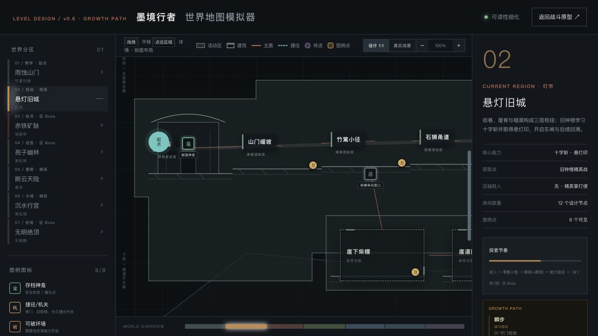
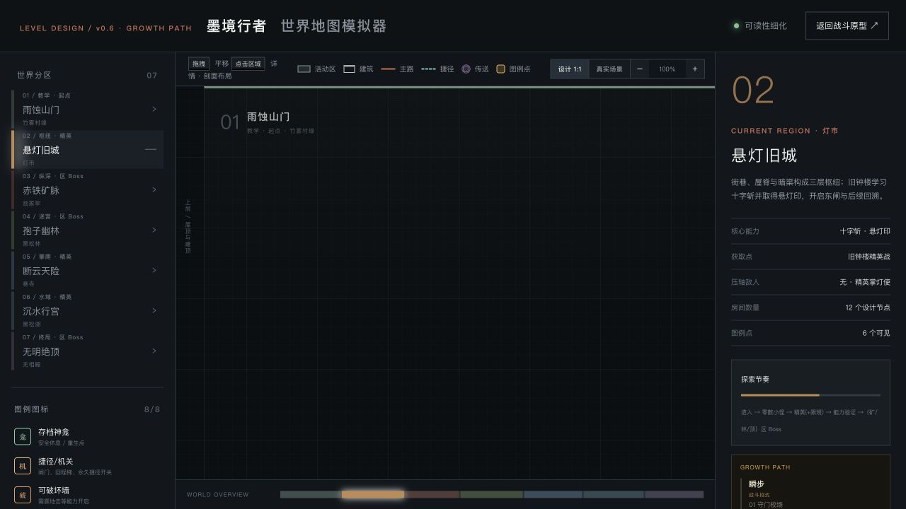
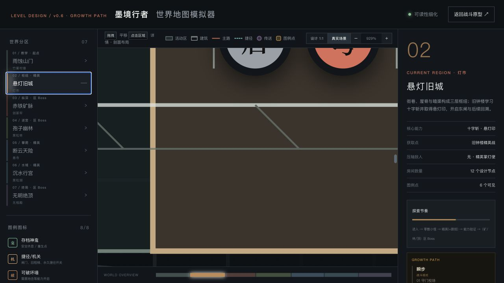
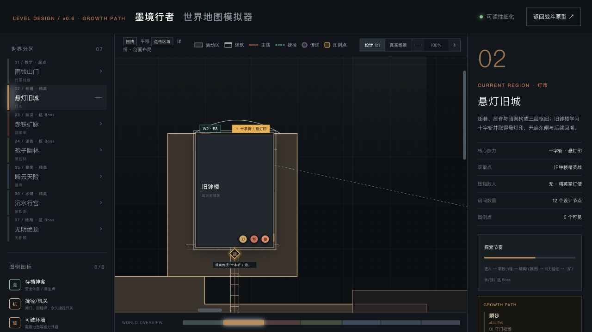
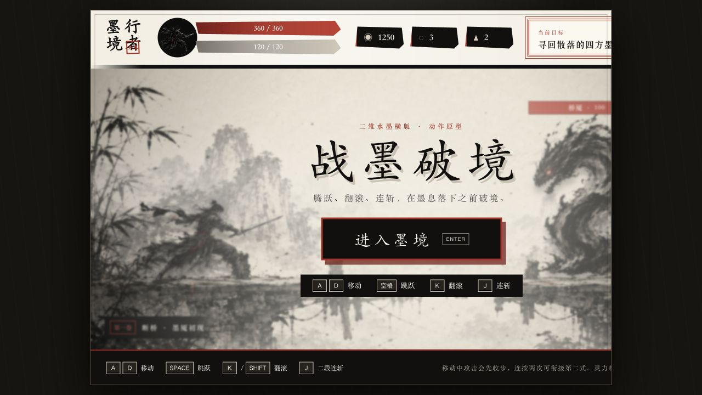

# 地图生产级关卡设计审查（2026-08-05）

## 结论

这版已经从“概念世界图”进入“可用于关卡策划沟通”的阶段：七区连续横向主路、纵向支路、能力获取/验证链、敌人生态、遭遇波次、单向回环和建筑白模都已建立。若以“直接交给关卡美术和程序搭建真实场景”为标准，当前完成度约为 **60%**；下一轮不应继续增加房间数量，而应把每个房间转换为可验证的摄影机、碰撞、入口、刷怪与复活数据。

## 现场证据

### 设计比例下，地图结构已经可读

横向连续性、上下层、地板、房屋、梯子、单向落口和地下回程已经能够被读懂。每区约 10–12 个设计节点，符合“大区至少十屏内容”的节点数量目标。

### 默认视图和真实场景缩放仍会失去焦点

初次打开时主体地形位于画面下方，中心出现大面积空白。切换“真实场景”后，929% 像素级缩放会让一个房间远大于中部视窗：

这不是地图内容问题，而是模拟器的观察模型仍停留在“放大画布”，还没有成为“逐屏施工预览器”。

### 战斗节点已有波次，但仍缺空间落点

旧钟楼已经定义 W2、B8、触发顺序、敌人类型与高台/地面职责，但“地面、高台、首领位”仍是语义标签，没有精确出生坐标、朝向、巡逻范围、激活区、锁门区和脱战边界。

### 当前地图的一屏标尺与真实战斗画面不一致

地图使用固定 `1672×941px = 180×101u`。本次实际运行在 1280×720 浏览器中，战斗 `.stage` 为约 `1169.8×512px`，如果仍把宽度定义成 180u，高度只有约 78.8u。也就是说，当前地图对一屏垂直空间的估算比真实运行画面高约 28%。响应式宽高继续变化时误差还会变化。

## 按真实场景制作流程检查

1. **世界推进与能力链 — 健康**
   - 瞬步、十字斩、震地击、闭息诀、水行符都有获取和后续验证。
   - 三印、水镜信物和终局校验形成清楚的主线闭环。
   - 建议保留当前战斗节点密度，不因节点数量再删战斗。

2. **摄影机与屏幕尺度 — 高风险**
   - 先确定唯一逻辑摄影机：例如固定 16:9 逻辑分辨率；运行时只做等比缩放、裁切或扩展安全区。
   - 地图不要直接使用当前 DOM 的实际像素作为世界单位。
   - 同时绘制 16:9 基准框、宽屏扩展区、UI 安全区，避免场景在不同窗口比例下露馅。
   - 每个房间建立 `cameraVolumes[]`，标记跟随、锁定、纵向抬镜、前视量、边界和切换方式。

3. **十屏大区的施工拆分 — 待补**
   - 目前“房间节点数”达到十屏，但没有明确指出一个节点究竟占 1 屏、1.5 屏还是 2.5 屏。
   - 每区应拆为 `区号-屏号`，如 `T-01` 到 `T-12`；每屏记录矩形范围和左右/上下出口。
   - 连续横向主路可跨屏无切场；Boss 房、特殊机关房只在数据上成为独立加载块，不必在操作中频繁切场。
   - 竖井、钟楼、地下水廊这类高房间需要多个纵向摄影机段，而不是只放一个通用取景框。

4. **物理碰撞与可达性 — 高风险**
   - 目前物理标尺只覆盖角色高、跳高、跑跳跨度、抓梯和安全落差；还缺碰撞盒宽度、移动速度/加速度、空中控制、跳跃顶点时间、土狼时间、跳跃缓冲、受击后退与攻击距离。
   - 房间拓扑与视觉连线是两套数据，验证器只证明“逻辑房间可达”，不能证明玩家真的能从一块地板跳到另一块地板。
   - 每条连接应绑定入口锚点、出口锚点、移动动作、能力条件、水平距离、垂直落差和回程方式；自动检查这些数值是否超过角色能力。
   - 梯子需要验证顶部/底部是否与可站立地板相交；桥梁需要有效落脚宽度；单向落口需要验证回程链而不只是图上存在回程标记。

5. **遭遇和敌人部署 — 中风险**
   - 保留现有 W/B 与触发设计，但为每个敌人增加：`spawn(x,y)`、朝向、巡逻区、索敌区、脱战区、刷新规则、入场方式和所属摄影机段。
   - “高台/地面/首领位”应成为可视化锚点，直接画在房间轮廓中。
   - 增加敌人成本表，使 B6/B8/B16 能随玩家当前能力等级被比较，而不只是人工标签。
   - 对弩手、飞行敌人、链狱卒增加最小安全距离检查，避免出生点与入口、梯子或落坑重叠。

6. **连续场景过渡 — 中风险**
   - 当前已经写出“同场景横向转入、洞口过渡无切场”等语义，但缺 1–2 屏长的过渡构造。
   - 每个区界应设计为材质与玩法渐变：旧城砖石逐步混入矿木支架；矿脉根系侵入后进入幽林；断崖雨水汇入行宫水路；行宫排水构筑物转成登顶石阶。
   - 过渡屏要同时承担卸载旧区、预载新区、降低敌人压力和提供远景预告，不应只是一条连接线。

7. **复活、失败回路与资源点 — 中风险**
   - 现有可见神龛集中在山门、旧城、幽林、悬寺和绝顶；矿底 Boss、行宫精英/墨姬附近缺少明确重试锚点。
   - 不必增加独立安全房，可以在连续场景中放隐形重试点或战前临时魂灯，保证失败后 20–40 秒内回到关键战斗。
   - 单向落坑、水下段和竖井需要明确死亡/失败后回到哪一屏，避免重复长跑。

8. **特殊环境 — 待补**
   - 水下、毒雾、脆地、升降梯目前主要是图例点，尚未成为带范围的物理体积。
   - 水下应补游速、上下移动、换气时间、氧气点、出水口和摄影机浮力跟随；毒雾应补伤害/状态积累范围；脆地应补破坏后导航和存档状态。

## 建议的下一轮优先顺序

1. 锁定逻辑摄影机与宽高策略，修正 `180×101u` 标尺。
2. 将每区拆成 10–14 个具名摄影机段，并让“真实场景”一键适配一个摄影机框。
3. 把视觉连接与逻辑拓扑合并成同一条带锚点的连接数据，并加入跳跃/梯子/落差校验。
4. 为旧钟楼、剑冢牢底、水下长廊、无相殿顶各完成一个生产级样板房：碰撞、摄影机、出生点、触发器、复活点全部落坐标。
5. 样板验证通过后再批量展开其余房间，避免全图继续扩充后返工。

## 推荐的单屏数据模板

每个 `ScreenChunk` 至少包含：

- `id / zone / bounds / cameraBounds / safeFrame`
- `entryAnchors / exitAnchors / transitionType / preloadZone`
- `solidPolygons / oneWayPlatforms / ladders / bridges / hazards`
- `spawnGroups / triggerVolumes / leashVolumes / lockDoors`
- `checkpoint / deathReturn / firstClearState`
- `requiredAbility / testedAbility / reward`
- `artSet / foregroundMask / backgroundParallax / audioZone`

这样地图才能从“读图正确”升级为“可以直接生成真实关卡白盒”。
